# Epam AWS Fundamentals Task

- [Website on AWS](http://web.richard-adolfo-vega-almanza.s3-website-us-east-1.amazonaws.com/)
- [Website on GitHub Pages](https://www.richardalmanza.com/)
- [Repository epam-aws branch](https://github.com/RichardAlmanza/RichardAlmanza/tree/epam-aws)

## Content

- [Epam AWS Fundamentals Task](#epam-aws-fundamentals-task)
  - [Content](#content)
  - [Create Bucket S3](#create-bucket-s3)
  - [Create IAM user for GitHub Actions](#create-iam-user-for-github-actions)
  - [Create access key for IAM User](#create-access-key-for-iam-user)
  - [Setting the secrets up in the GitHub repository](#setting-the-secrets-up-in-the-github-repository)
  - [GitHub repository changes](#github-repository-changes)
  - [Static website hosting - S3](#static-website-hosting---s3)

## Create Bucket S3

1. **AWS Console > S3 > Create Bucket**
    

    
Create Bucket

    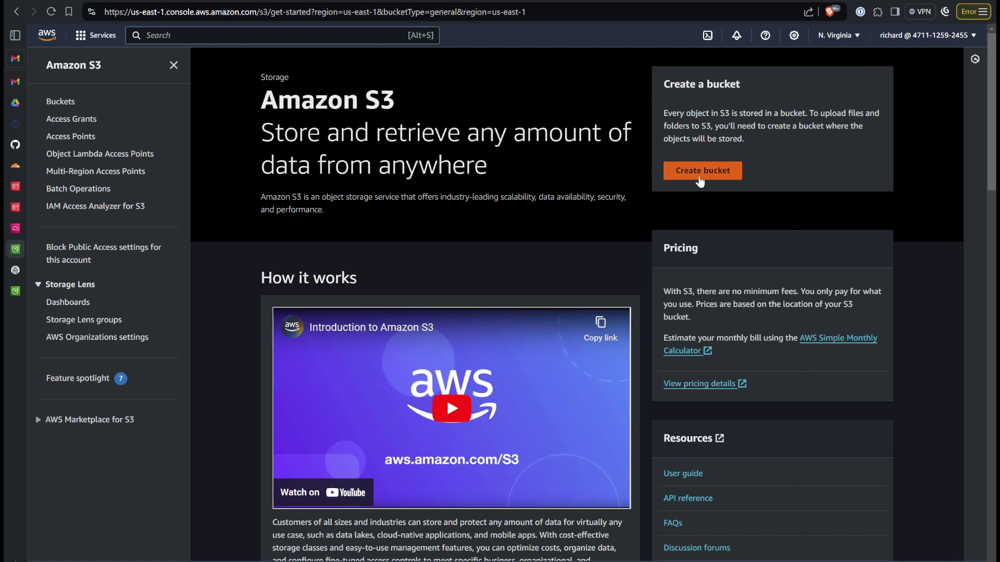

    

2. **General configuration** card
   1. Select **Bucket type > General Purpose**
   2. Fill the **Bucket name** field `web.richard-adolfo-vega-almanza`
   

    
<b>General configuration</b> card

    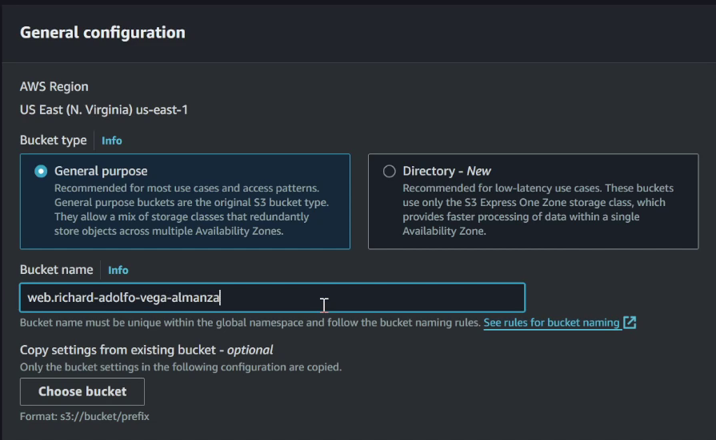

    

3. **Object Ownership** card
   1. Select **ACLs enabled**
   2. Select **Object Ownership > Bucket owner preferred**
   

    
<b>Object Ownership</b> card

    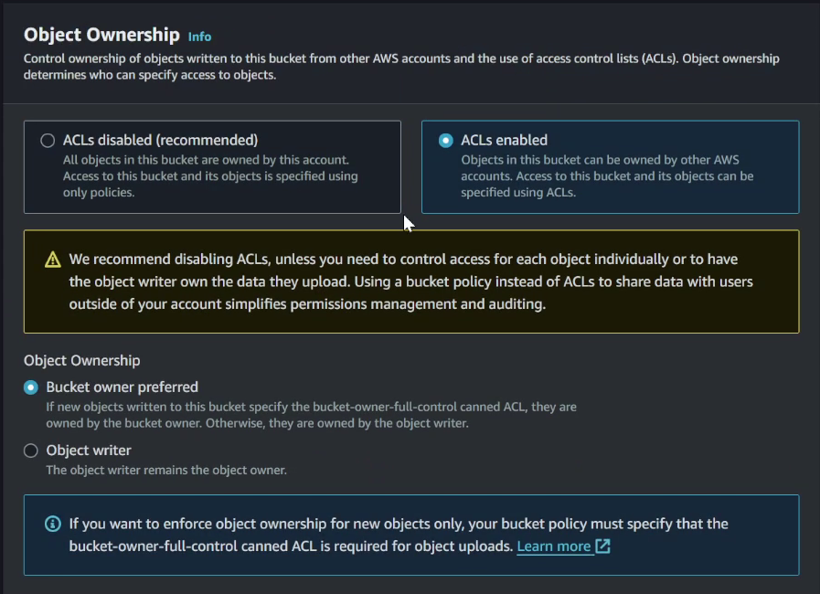

    

4. **Block Public Access settings for this bucket** card
   1. Deselect/Clear **Block all public access**
   2. Select **I acknowledge that the current settings might result in this bucket and the objects within becoming public** in the warning message at the card's bottom
   

    
<b>Block Public Access settings for this bucket</b> card

    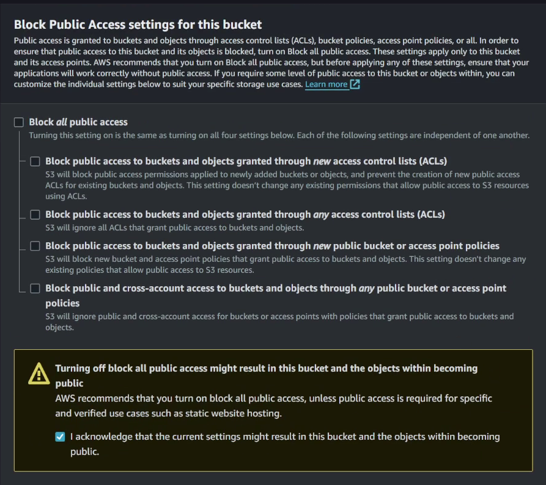

    

5. **Bucket Versioning** card
   1. Leave it **Bucket Versioning > Disable**, the git repository already manage a history
   

    
<b>Bucket Versioning</b> card

    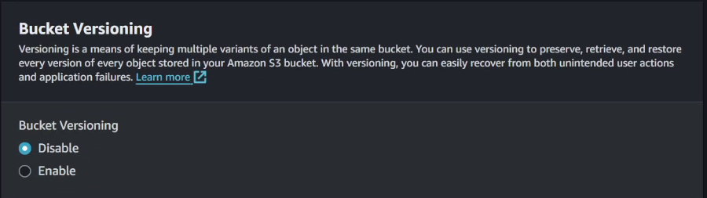

    

6. **Tags - optional** card
   1. **Add tag**
      * Key `env`
      * Value `temp`
   

    
<b>Tags - optional</b> card

    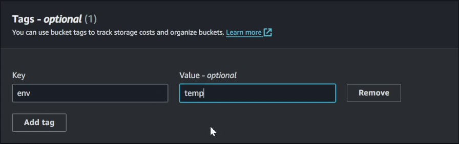

    

7. **Create Bucket**
   1. Leave the **Default encryption** card as default
   2. leave the **Advanced settings** options as default
   3. Click the **Create bucket** button
   

    
Create bucket

    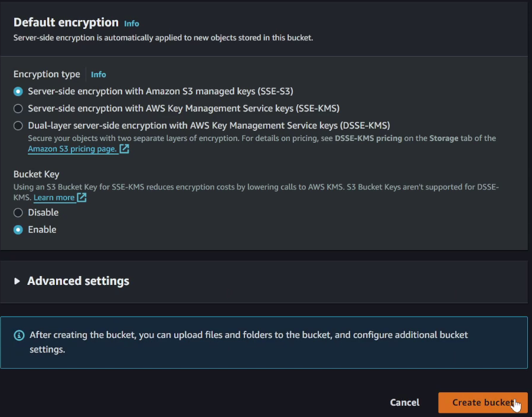

    

## Create IAM user for GitHub Actions

1. **IAM > Users > Create User**
   

    
<b>Create User</b>

    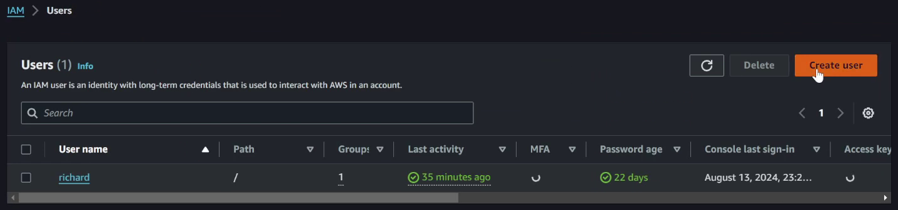

    

2. **User details** card
   1. Fill the **User name** field, `github_actions` (in the image is `github_user` but I changed it)
   2. Leave deselected **Provide user access to the AWS Management Console - optional**
   3. Click the **Next** button
   

    
<b>User details</b> card

    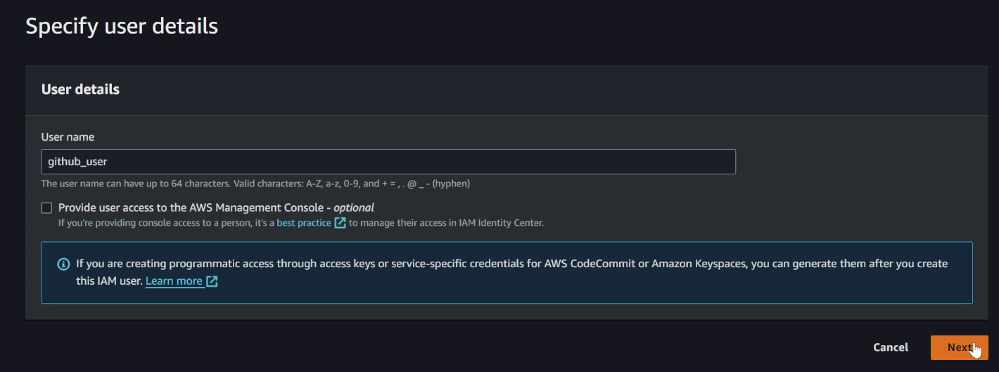

    

3. **Set permissions** Section
   1. Select **Permission options > Add user to group**
   2. Click **User groups > Create group**
   

    
<b>set permissions</b> Section

    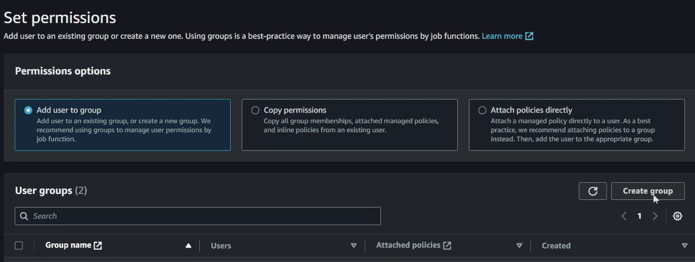

    

4. **Create user group** popup
   1. Fill the  **User group name** field, `S3WriteOnly-web.richard-adolfo-vega-almanza`
   2. Click **Create Policy** Bbtton
   

    
<b>Create user group</b> popup

    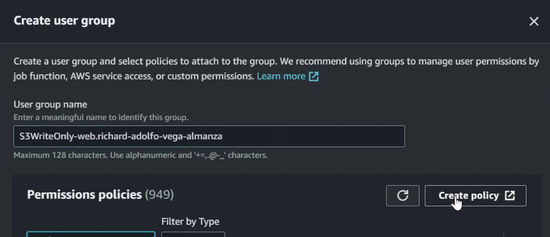

    

5. **Policy editor** card
   1. Click **Policy editor > JSON**
   

    
<b>Policy editor</b> card

    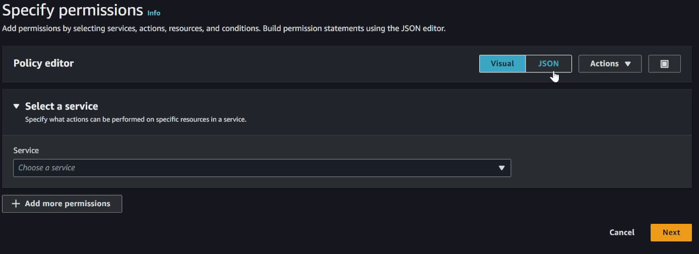

    

6. **Policy editor** card
   1. Paste the following policy
   2. Click **Next** button

    

        
<b>IAM POLICY</b>

    <pre>
    {
        "Version": "2012-10-17",
        "Statement": [
            {
                "Sid": "VisualEditor0",
                "Effect": "Allow",
                "Action": [
                    "s3:PutObject",
                    "s3:ListBucket",
                    "s3:DeleteObject",
                    "s3:PutObjectAcl"
                ],
                "Resource": [
                    "arn:aws:s3:::web.richard-adolfo-vega-almanza/*",
                    "arn:aws:s3:::web.richard-adolfo-vega-almanza"
                ]
            }
        ]
    }
    <code>
    

   

    
<b>Policy editor</b>

    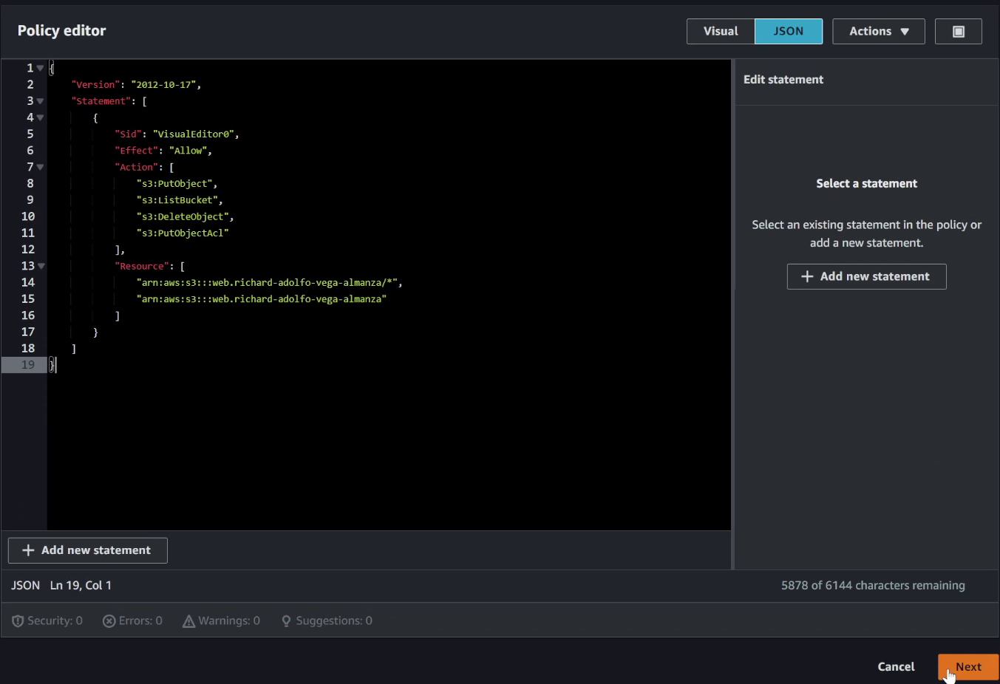

    

7. **Policy details** card
   1. Fill **Policy name** field, `PublishObjectsS3-web.richard-adolfo-vega-almanza`
   2. Fill **Description - optional** field, `Permision mainly for pipelines that will upload the static web`
   3. Scroll down to the **Add tags - optional** card

   

    
<b>Policy editor</b> card

    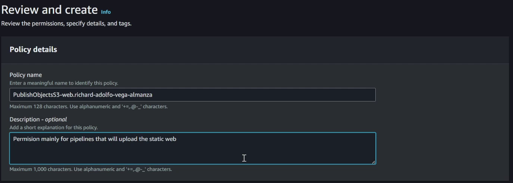

    

8. **Add tags - optional** card
   1. **Add tag**
      * Key `env`
      * Value `temp`
   2. Click **Create Policy** button

   

    
<b>Add tags - optional</b> card

    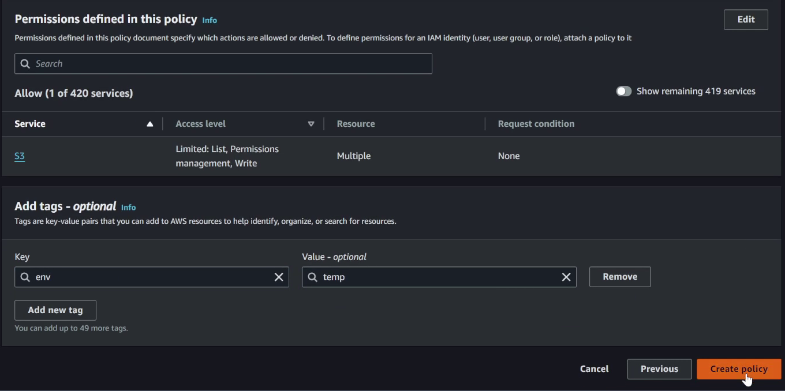

    

9. **Create user group** popup
   1. lookup for the recent policy
   2. Select it
   3. Click **Create user group** button

   

    
<b>Create user group</b> popup

    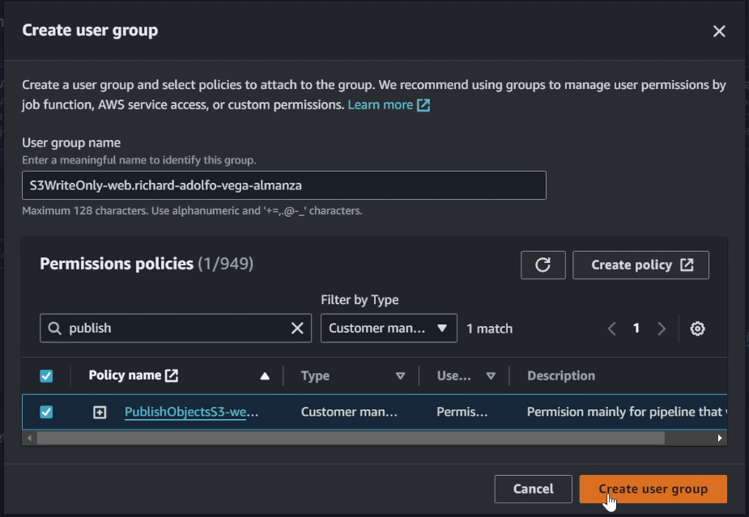

    

10. **User groups** card
    1. Select the recent created group
    2. Click **Next** button

    

    
<b>Create user group</b> popup

    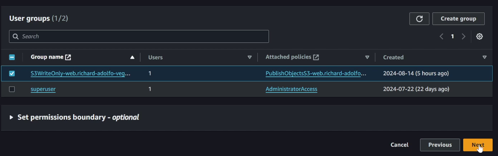

    

11. **Add tags - optional** card
    1.  **Add tag**
        * Key `env`
        * Value `temp`
    2. Click **Create user** button

    

    
<b>Add tags - optional</b> popup

    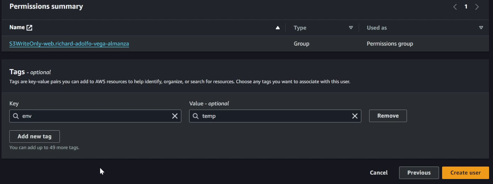

    

## Create access key for IAM User

1. **IAM > User**
   1. Click on the `github_actions` user

   

        

                <b>IAM users</b>
        

    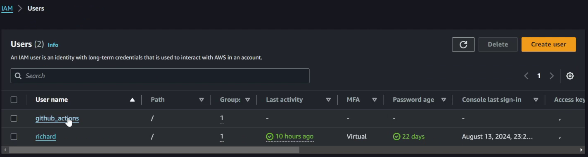
   

2. **Security Credentials tab**
   1. Click on the **Security credentials** tab
   2. Scroll down to the **Access Keys** card

   

        

                <b>Security Credentials</b>
        

    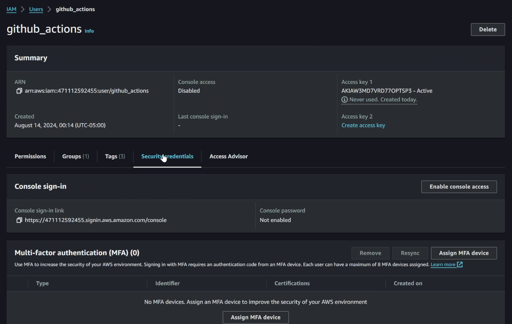
   

3. **Access keys**
   1. Click on the **Create access key** button

   

        

                <b>Access keys</b> card
        

    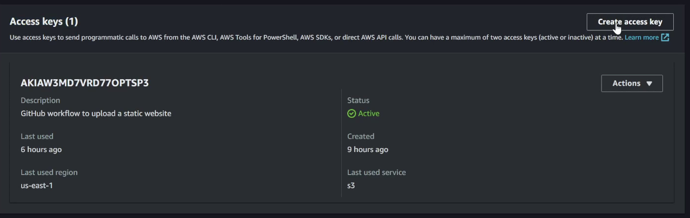
   

4. **Access key best practices & alternative**
   1. Select **Command Line Interface (CLI)**
   2. Check `I understand the above recommendation and want to proceed to create an access key` at the bottom
   3. Scroll down and click on the **Next** button

   

        

                <b>Access key best practices & alternative</b>
        

    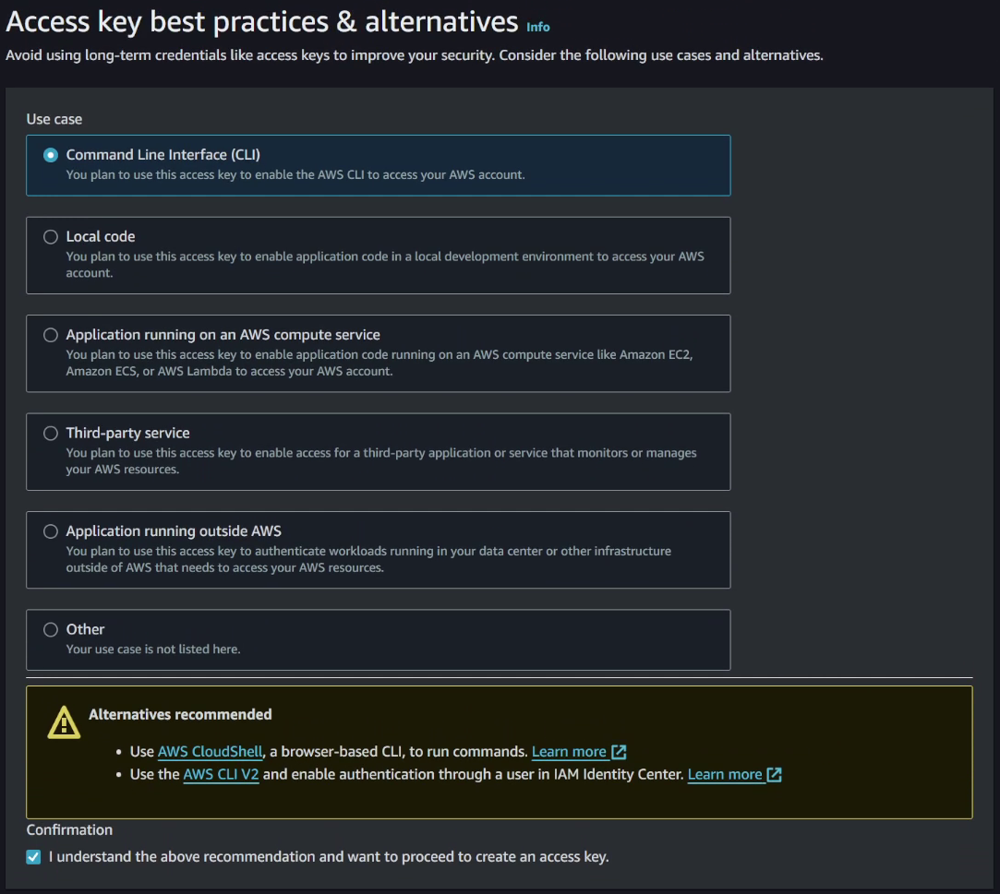
   

5. **Set description tag - optional**
   1. Fill the **Description tag value** with `GitHub workflow to upload a static website`
   2. Click on **Create access key** button

   

        

                <b>Set description tag - optional</b> card
        

    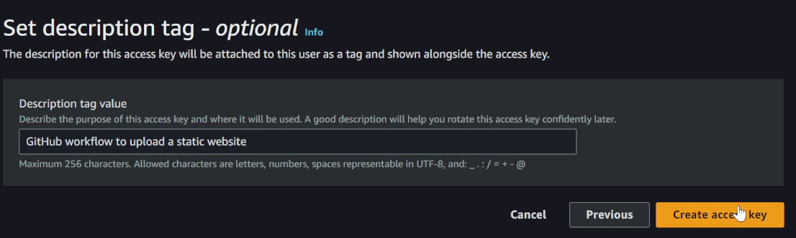
   

6. **Retrieve access keys**
   1. Save the **Access key** and **Secret access key** values
   2. Click on the **Done** button

   

        

                <b>Retrieve access keys</b> section
        

    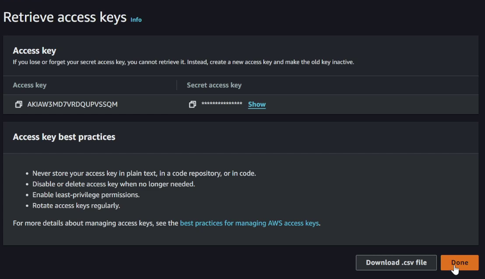
   

## Setting the secrets up in the GitHub repository

1. **GitHub Secrets**
   1. Go to the **Settings** tab of the repository
   2. In the left panel go to **Security > Secrets and variables > Actions**
   3. Click on the **New repository secret**

   

        

                <b>GitHub Secrets</b> section
        

    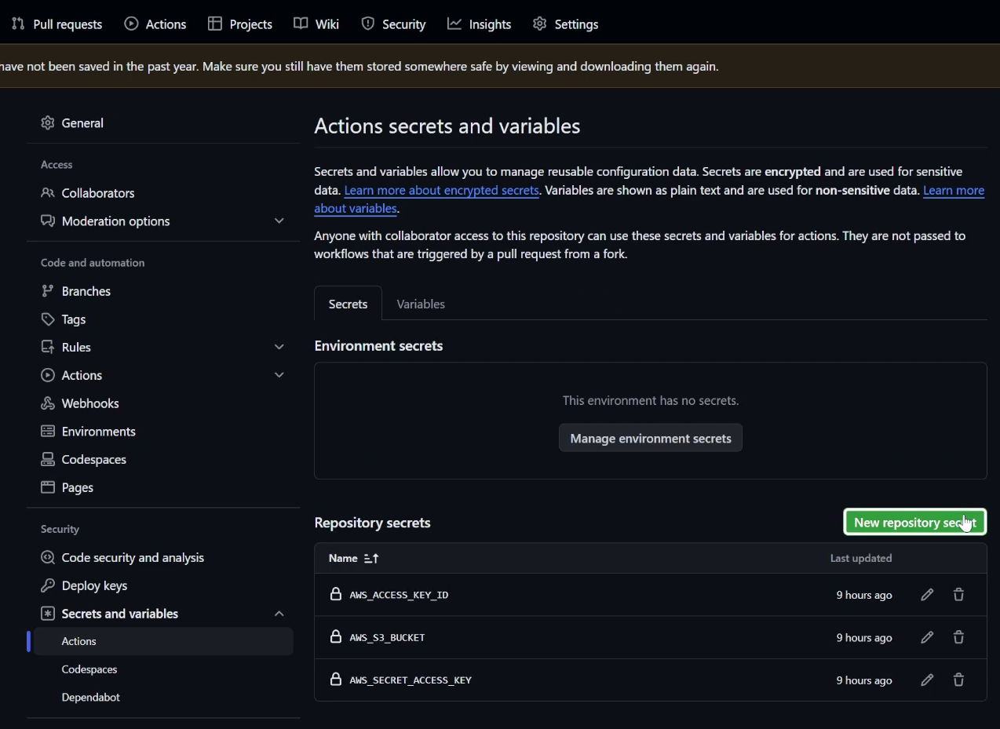
   

2. **Add Repository secret**
   1.  Fill the **Name** field with `AWS_ACCESS_KEY_ID`
   2.  Fill the **Secret** field with *The github_action access key*
   3.  Click on **Add secret** button
   4.  Repeat with the following secrets
       - `AWS_SECRET_ACCESS_KEY`
         - *The secret of the github_action access key*
       - `AWS_S3_BUCKET`
         - `web.richard-adolfo-vega-almanza`

    

        

                <b>Add Repository secret</b> section
        

    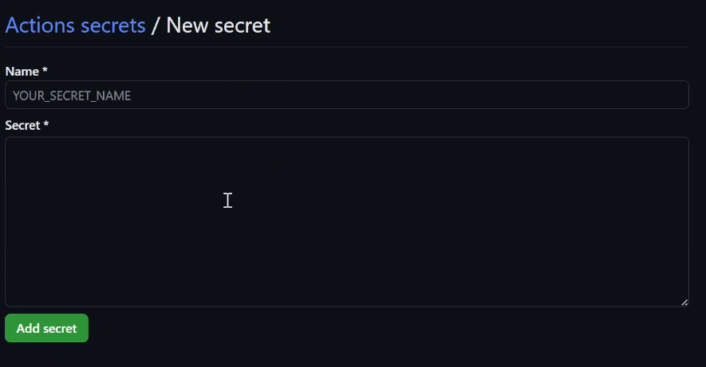
   

## GitHub repository changes

My personal website already have a GitHub workflow, so I edited it a little

So, I

1. Created a new branch name `epam-aws`
2. Removed the triggers based on commits
3. Changed or removed values made for GitHub pages
4. Replaced the deployment action made for GitHub pages to AWS S3
5. Removed the folder `fontawesome-5` from the rendered website to avoid tons of PUT calling to upload all those tiny files, avoiding reaching the free tier limit of S3 by just one workflow
6. Triggered manual;y the workflow

    

            <b>Commit changes</b> Diff
    

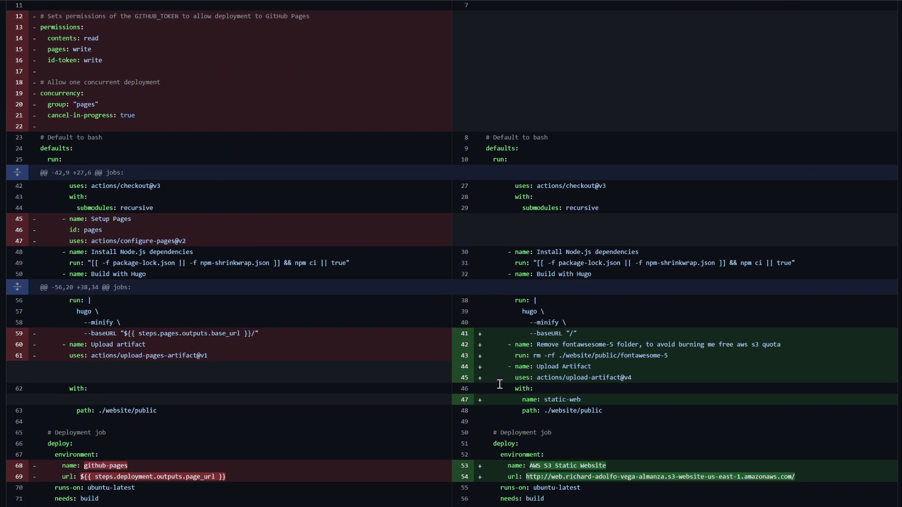
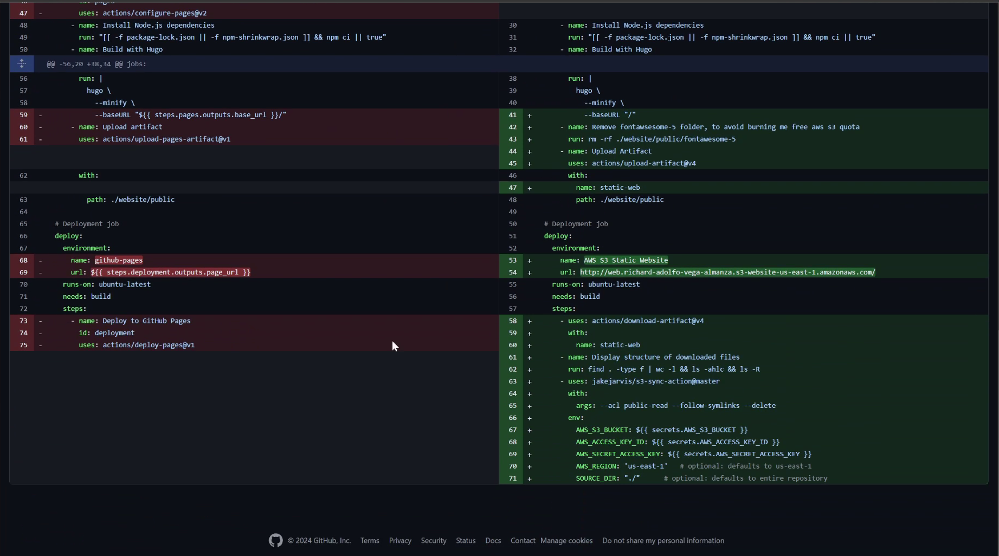

## Static website hosting - S3

1. **AWS Console > S3 > Buckets > aws.richard-adolfo-vega-almanza**
   1. Click on **Properties** tab
   2. Scroll down to the **Static website hosting** card at the end of the page

   

        

                <b>Bucket's properties</b> tab
        

    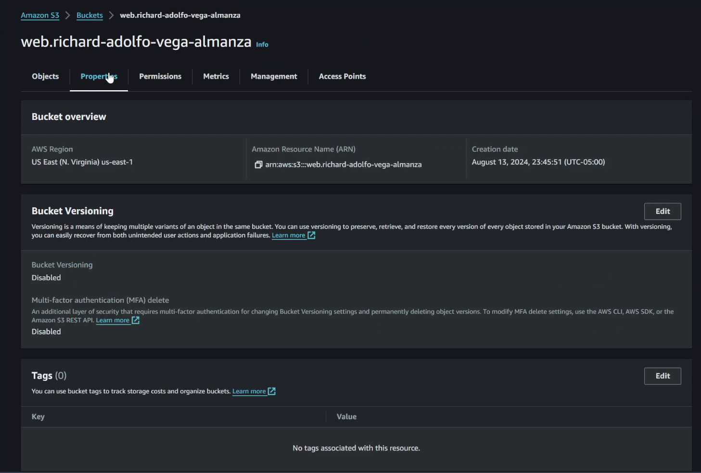
   

2. **Static website hosting**
   1. Click on the **Edit** button

   

        

                <b>Static website hosting</b> card
        

    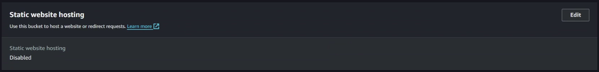
   

3. **Static website hosting**
   1. Select **Static website hosting > Enabled**
   2. Select **Hosting type > Host a static website**
   3. Fill the **Index document** field, in my case `index.html`
   4. Fill the **Error document - optional** field, in my case `404.html`
   5. Scroll down and click on the **Save changes** button

   

        

                <b>Static website hosting</b> card
        

    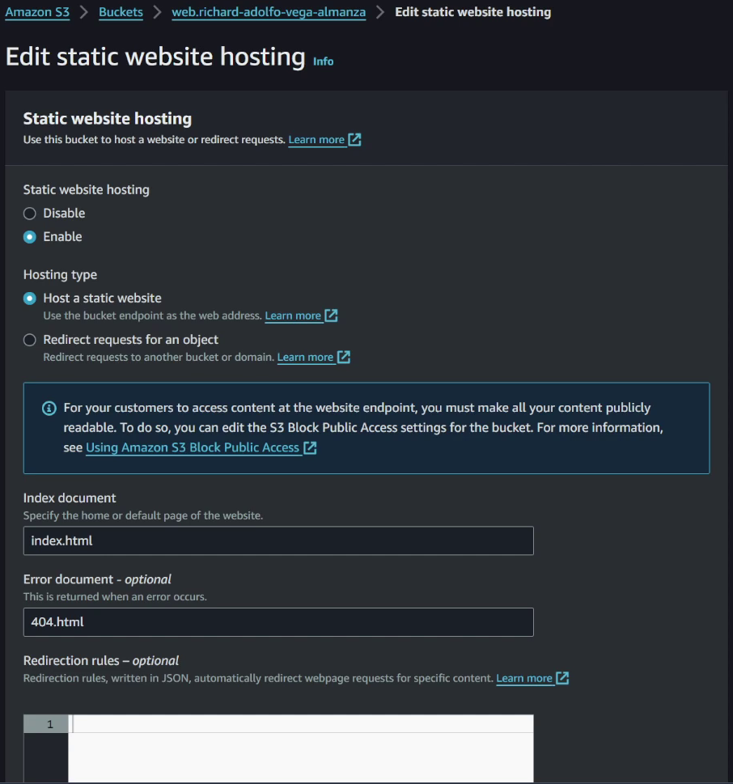
   

4. **Get the Website URL**
   1. Click on the [*Link*](http://web.richard-adolfo-vega-almanza.s3-website-us-east-1.amazonaws.com/) at the bottom of the **Static website hosting** card

   

        

                <b>Static website hosting</b> card
        

    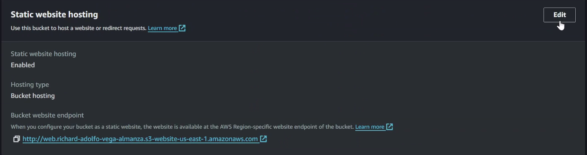
   

   

        

                <b>Main/Home page</b>
        

    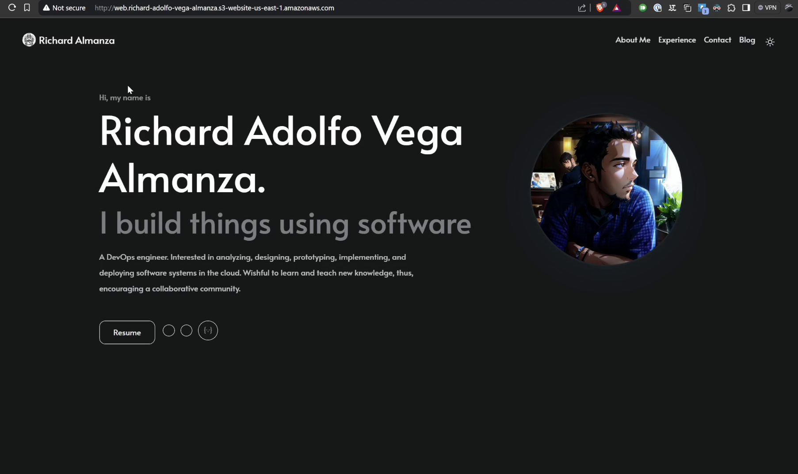
   

   

        

                <b>Error/NotFound Page</b>
        

    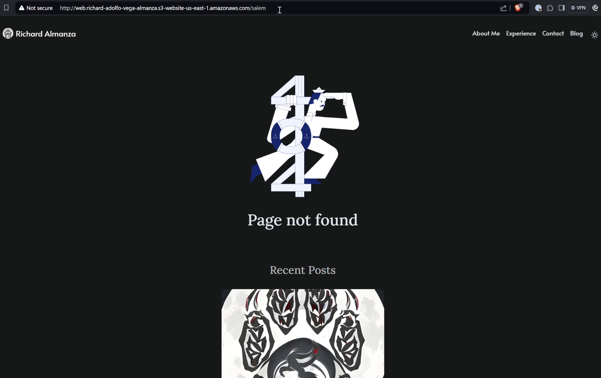
   

